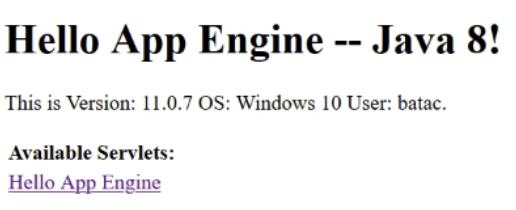

# Cloud Computing - Laboratory 04: Google App Engine

Authors : Baptiste Hardrick & David Jaquet

## Task 1: Deployment of a simple web application

- What does the sample code generated by the wizard do? Explain what you see in the **Java class files, web.xml, appengine-web.xml** and **index.jsp** files in a few sentences.

  - `HelloAppEngine.java` :

    - This file is a Servlet. With the annotation `@WebServlet`, we can see that the Servlet handle the request targetting the `/hello` URI. The server will handle only the `GET` request. The request will be handle by the `doGet` method. A text response is prepare and will contain some informations about the Java version used as shown below:
  
    
- `web.xml` :
  
  - It is the deployment descriptor. This file is used by the application to define the `URLs` to map on the servlets, those that require an authentification and others informations.
  
    In the `web.xml`, we can a description of the classes, the ressources, the configuration of the application.
      In our case, the `web.xml` contains a `welcome-file` tag. This tag define a default file (`index.jsp`) for the application. It is the front page of our application.
  
  - The informations were find on the [Google Documentation](https://cloud.google.com/appengine/docs/standard/java/config/webxml?hl=fr) and the website [javatpoint](https://www.javatpoint.com/welcome-file-list).
  
- `appengine-web.xml` :
  
  - This file is a complement to the deployment descriptor. Indeed, the applications of the App Engine use the `appengine-web.xml` file to specify some information about the application.
      In our case, we have the tags below :
  
    | Tag                 | Value                                                        | Description                                                  |
      | ------------------- | ------------------------------------------------------------ | ------------------------------------------------------------ |
      | `runtime`           | java8                                                        | Specify the runtime environment to `Java 8`. The environments for App Engine are on `OpenJDK` |
      | `threadsafe`        | true                                                         | If the value is false, App Engine send requests serially to a web server. If the value is true, App Engine send requests in parallel. |
      | `system-properties` |                                                              | Used to define some system properties and environment variables that are set when the application is running |
      | `property`          | name = `java.util.logging.config.file`<br />value = `WEB-INF/logging.properties` | The files cannot be find in the project.                     |
  
    - The informations were find on the [Google Documentation](https://cloud.google.com/appengine/docs/standard/java/config/appref).
  
- `index.jsp` :
  
  - It's the front page of our application. This fils is mainly written in `HTML` but contains some `Java` and can contains some `CSS` too. Here, the file describe the Servlets available. For now, we have only the `HelloAppEngine` automatically generated by the Google App Engine. The file use a statical method in the `HelloAppEngine` class to have the Java version, the name of the Operating System (OS) and the name of the user. You can find below a screenshot of our page :
  

## Task 2: Develop a Servlet that uses the Datastore

- Copy the Servlet into the report.

  - You can find below our Servlet. It is important to notice that we didn't paste the imported libraries. 

    ```java
    @WebServlet(name = "DatastoreWrite", value = "/datastorewrite")
    public class DatastoreWrite extends HttpServlet {
    
        @Override
        protected void doGet(HttpServletRequest req, HttpServletResponse resp)
                throws IOException {
    
            resp.setContentType("text/plain");
            PrintWriter pw = resp.getWriter();
            pw.println("Writing entity to datastore.");
    
            Enumeration<String> parameters = req.getParameterNames();
            String _kind = "";
            String _key = "";
            Map<String, String> otherParameters = new HashMap<>();
            while(parameters.hasMoreElements()) {
                String parameter = parameters.nextElement();
    
                switch(parameter) {
                    case "_kind":
                        _kind = req.getParameter(parameter);
                        break;
                    case "_key":
                        _key = req.getParameter(parameter);
                        break;
                    default:
                        otherParameters.put(parameter, req.getParameter(parameter));
                }
            }
    
            if(_kind.isEmpty())
                throw new IOException("The kind is mandatory!");
    
            // src : https://www.baeldung.com/java-random-string#java8-alphanumeric
            // Hypothesis : Keys aren't unique. So multiple elements can 
            // have the same key
            if(_key.isEmpty()) {
                int leftLimit = 48; // numeral '0'
                int rightLimit = 122; // letter 'z'
                int targetStringLength = 10;
                Random random = new Random();
    
                _key = random.ints(leftLimit, rightLimit + 1)
                             .filter(i -> 
                                     (i <= 57 || i >= 65) && (i <= 90 || i >= 97)
                             ).limit(targetStringLength)
                             .collect(StringBuilder::new,
                                      StringBuilder::appendCodePoint,
                                      StringBuilder::append
                             ).toString();
            }
    
            pw.println("The entity to store is");
            pw.println("Kind: " + _kind);
            pw.println("Key: " + _key);
            otherParameters.forEach((parameter, value) -> 
                                    pw.println(parameter + ": " + value)
    		);
    
    
            pw.println("\nSaving the entity...");
            DatastoreService datastore = DatastoreServiceFactory.getDatastoreService();
            Entity entity = new Entity(_kind);
            entity.setProperty("Key", _key);
            otherParameters.forEach(entity::setProperty);
            datastore.put(entity);
            pw.println("\nEntity is saved ! :D");
    
            // src : http://tutorials.jenkov.com/java-io/printwriter.html
            // The sample given does not close the PrintWriter, 
            // but we thought we sould do it :)
            pw.close();
        }
    }
    ```

- Copy a screenshot of the local and the App Engine console with the Datastore Viewer.

  - We create different kind of datas, we create a book and a movie as shown in the screenshots below:

    

    

    

## Task 3: Test the performance of Datastore writes

- For each performance test copy a screenshot of the JMeter **Graph Results** listener and the App Engine **Dashboard** view into the report.
- What response times do you observe in the test tool for each Servlet?
- Compare the response times shown by the test tool and the App Engine console. Explain the difference.
- How much resources have you used running these tests? From the **Quota Details** view of the console determine the non-zero resource quotas (**Daily quota** different from 0%). Explain each with a sentence. To get a sense of everything that is measured click on **Show resources not in use**.
- Let's suppose you become suspicious that the algorithm for the automatic scaling of instances is not working correctly. Imagine a way in which the algorithm could be broken. Which measures shown in the console would you use to detect this failure?