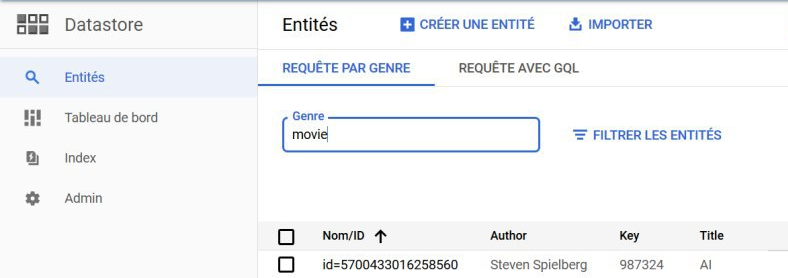
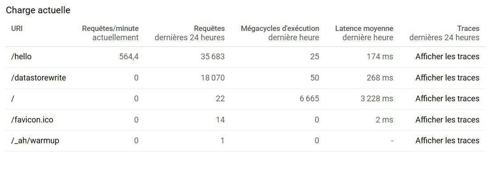

# Cloud Computing - Laboratory 04: Google App Engine

Authors : Baptiste Hardrick & David Jaquet

## Task 1: Deployment of a simple web application

- What does the sample code generated by the wizard do? Explain what you see in the **Java class files, web.xml, appengine-web.xml** and **index.jsp** files in a few sentences.

  - `HelloAppEngine.java` :

    - This file is a Servlet. With the annotation `@WebServlet`, we can see that the Servlet handle the request targetting the `/hello` URI. The server will handle only the `GET` request. The request will be handle by the `doGet` method. A text response is prepare and will contain some informations about the Java version used as shown below:
    
  
  - `web.xml` :
    
    - It is the deployment descriptor. This file is used by the application to define the `URLs` to map on the servlets, those that require an authentification and others informations.
      In the `web.xml`, we can a description of the classes, the ressources, the configuration of the application.
      In our case, the `web.xml` contains a `welcome-file` tag. This tag define a default file (`index.jsp`) for the application. It is the front page of our application.
    
    - The informations were find on the [Google Documentation](https://cloud.google.com/appengine/docs/standard/java/config/webxml?hl=fr) and the website [javatpoint](https://www.javatpoint.com/welcome-file-list).
    
  - `appengine-web.xml` :
    
    - This file is a complement to the deployment descriptor. Indeed, the applications of the App Engine use the `appengine-web.xml` file to specify some information about the application.
      In our case, we have the tags below :
    
      | Tag                 | Value                                                        | Description                                                  |
      | ------------------- | ------------------------------------------------------------ | ------------------------------------------------------------ |
      | `runtime`           | java8                                                        | Specify the runtime environment to `Java 8`. The environments for App Engine are on `OpenJDK` |
      | `threadsafe`        | true                                                         | If the value is false, App Engine send requests serially to a web server. If the value is true, App Engine send requests in parallel. |
      | `system-properties` |                                                              | Used to define some system properties and environment variables that are set when the application is running |
      | `property`          | name = `java.util.logging.config.file`<br />value = `WEB-INF/logging.properties` | The files cannot be find in the project.                     |
    
    - The informations were find on the [Google Documentation](https://cloud.google.com/appengine/docs/standard/java/config/appref).
    
  - `index.jsp` :
    
    - It's the front page of our application. This fils is mainly written in `HTML` but contains some `Java` and can contains some `CSS` too. Here, the file describe the Servlets available. For now, we have only the `HelloAppEngine` automatically generated by the Google App Engine. The file use a statical method in the `HelloAppEngine` class to have the Java version, the name of the Operating System (OS) and the name of the user. You can find below a screenshot of our page :
      

## Task 2: Develop a Servlet that uses the Datastore

- Copy the Servlet into the report.

  - You can find below our Servlet. It is important to notice that we didn't paste the imported libraries. 

    ```java
    @WebServlet(name = "DatastoreWrite", value = "/datastorewrite")
    public class DatastoreWrite extends HttpServlet {
    
        @Override
        protected void doGet(HttpServletRequest req, HttpServletResponse resp)
                throws IOException {
    
            resp.setContentType("text/plain");
            PrintWriter pw = resp.getWriter();
            pw.println("Writing entity to datastore.");
    
            Enumeration<String> parameters = req.getParameterNames();
            String _kind = "";
            String _key = "";
            Map<String, String> otherParameters = new HashMap<>();
            while(parameters.hasMoreElements()) {
                String parameter = parameters.nextElement();
    
                switch(parameter) {
                    case "_kind":
                        _kind = req.getParameter(parameter);
                        break;
                    case "_key":
                        _key = req.getParameter(parameter);
                        break;
                    default:
                        otherParameters.put(parameter, req.getParameter(parameter));
                }
            }
    
            if(_kind.isEmpty())
                throw new IOException("The kind is mandatory!");
    
            pw.println("The entity to store is");
            pw.println("Kind: " + _kind);
            pw.println("Key: " + _key);
            otherParameters.forEach((parameter, value) -> pw.println(parameter + 
                                                                     ": " + value));
    
            // If the key already exists, we update the values by
            // overwritting the old values
            Entity entity;
            if(_key.isEmpty())
                entity = new Entity(_kind);
            else
                entity = new Entity(_kind, _key);
    
            pw.println("\nSaving the entity...");
            otherParameters.forEach(entity::setProperty);
    
            DatastoreService datastore = DatastoreServiceFactory.getDatastoreService();
            datastore.put(entity);
    
            pw.println("\nEntity is saved ! :D");
    
            // src : http://tutorials.jenkov.com/java-io/printwriter.html
            // The sample given does not close the PrintWriter, but 
            // we thought we sould do it :)
            pw.close();
        }
    }
    ```
  
- Copy a screenshot of the local and the App Engine console with the Datastore Viewer.

  - We create different kind of datas, we create a book and a movie as shown in the screenshots below:

    

    

    

## Task 3: Test the performance of Datastore writes

- For each performance test copy a screenshot of the JMeter **Graph Results** listener and the App Engine **Dashboard** view into the report.

  - The screenshot is the detail of a JMeter test with requests to the `/hello` endpoint generated by the wizard.

    

    The screenshot above correspond to the second peak in the graphic below. It is important to notice that the first peak was a test to see if JMeter worked fine and the second one was registered to have a proper result graph.

    

    The screenshot below is the detail of a JMeter test with requests to the `/datastorewrite` endpoint. For this test, we create a default address like detailled in this array :

    | Parameter | Value               |
    | --------- | ------------------- |
    | `_kind`   | book                |
    | `author`  | John Steinbeck      |
    | `title`   | The Grapes of Wrath |

    

    This test corresponds to the third peak in the screenshots below. As you can see, we worked late in the night.
    

    

    

- What response times do you observe in the test tool for each Servlet?

  - Below, we can see the summary of the `HelloAppEngine` Servlet. We can see the response times is between 30ms and 66'581ms. The average time is 7671ms.
    

    Below, we can see the summary of the `DatastoreWrite` Servlet. We can see the response times is between 53ms and 302'655ms. The average time is 9'493ms.
    

- Compare the response times shown by the test tool and the App Engine console. Explain the difference.

  - In the screenshot below, we can see multiple values. The interesting ones are the second column (`current request/minute`) and the fourth one (`mean latency in the last hour`). It is important to notice that the array is not fully actual. Indeed, there is some incorrect values due to the refresh time (like the request by minute for example). Furthermore, we can see the mean latency for the last hour is  **174 ms** for the `HelloAppEngine` Servlet and **268ms** for the `DatastoreWrite` Servlet. The latency for our Servlet is higher that wizard Servlet due to the creation of the datas in the datastore.
    
    The response times is different between the JMeter test and the App Engine console because the the average response times on JMeter is calculated with the request sent and the App Engine calculates an average on the hour. The tests take approximately 3 minutes. So there is 57 minutes on the average of the App Engine who are not relevant.
    Furthermore, there is an higher percentage of error on JMeter. It is due to a lack of response because the cloud cannot handle as many requests. 

    

- How much resources have you used running these tests? From the **Quota Details** view of the console determine the non-zero resource quotas (**Daily quota** different from 0%). Explain each with a sentence. To get a sense of everything that is measured click on **Show resources not in use**.

  - The screenshot below indicate all events received in the past 24 hours. There is all informations received different from 0%. We can see below all quotas about requests (like the number of requests, the bandwith, ...). This give some informations about the billing. We have the following informations :

    - Number of requests : Number of request received
    - Bandwith (incoming and outcoming) : Bandwith used to communicate with clients
    - Number of secured request : Number of secured request received
    - Secured bandwith (incoming and outcoming) : Secured Bandwith used to communicate with clients
    - Frontend instances-hours : It is time took by the server to show the frontend content to the client.

    

    The screenshot below indicate the informations about the requests made on the `datastorewrite` endpoint. There details on resources used by the database. It is important to notice that `Cloud Firestore` is a database used by Google Cloud Platform.

    - Read operations in Cloud Firestore : Number of read operations in the database
    - API Cloud Firestore call : Number of call to the API
    - Datas stored in Cloud Firestore : Size of the datas stored
    - Datas sent to the API Cloud Firestore : Size of the elements stored
    - Datas received from Cloud Firestore : Size of the element received from Cloud Firestore. It is the result of the request. The server can send a status `OK` for example.
    - Cloud Firestore entity fetch ops : The number of queries or getch calls to the data store
    - Cloud Firestore entity writes ops : The number of write operations on the data store
    - Cloud Firestore index write ops : Number of indexes created by the datastore when an entity is created and no index is provided
    - Cloud Firestore network egresse : Traffic outgoing the Google internal network
    
    
    For both screenshots, it is important to notice that there is no daily quota and no quota by minute. It is because our instances are running since least 24 hours.
    We can find below the billing of the transaction. As we can see, we have no cost. This is because the the bill is not updated. The bill will be update 17 hours after the moment where the screenshot was taken. We firstly thought that the lack of cost was due to a insufficient usage of the resources, but the notice at the top of the screenshot change our mind.
    

- Let's suppose you become suspicious that the algorithm for the automatic scaling of instances is not working correctly. Imagine a way in which the algorithm could be broken. Which measures shown in the console would you use to detect this failure?

  - On the left side pannel, under App Engine, we can see that there is an Instances board. By clicking on it, we can see if autoscaled instances were created and correlate it with a time when there was a huge load. We can then conclude that the autoscaling algorithm is not working if no instance was created during a high load period.